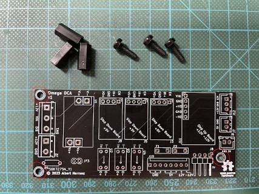

# Build Instructions

This document describes how to assemble an Omega DC Adapter.

## Bill Of Materials (BOM)

| **ref**    | **item**                              | **image**                                                                                               | **req_pcs** | **aliexpress_item**                                                                                                             | **pcs_per_item** | **req_items** | **option**           | **link**                                                                                                       |
| ---------- | ------------------------------------- | ------------------------------------------------------------------------------------------------------- | ----------- | ------------------------------------------------------------------------------------------------------------------------------- | ---------------- | ------------- | -------------------- | -------------------------------------------------------------------------------------------------------------- |
| U2, U3, U4 | OVP mini board                        |                                                | 3           | WeAct Over-Voltage Protection Module OVP 5.5V 2.5A 30V Power-protection Mini                                                    | 1                | 3             |                      | [aliexpress](https://www.aliexpress.com/item/1005001855053619.html) |
| J11        | Step Up +12V -12V board               |                                        | 1           | A08 DC-DC Boost Power Supply Module 5V 9V 12V 15V 24V Power Supply Module Ultra Small Step Up Circuit Board                     | 1                | 1             | 12V                  | [aliexpress](https://www.aliexpress.com/item/1005003879333333.html) |
| U1         | Ideal Diode RPP                       |                                                | 1           | Ideal Diode Module Battery Charging Charger Anti Reverse Connection Power Protection Board Module 4A Common Ground DC3-30V      | 1                | 1             |                      | [aliexpress](https://www.aliexpress.com/item/1005004921885625.html) |
| J9, J5, J3 | Step Down 5V mini board               |        | 3           | Mini DC-DC 12-24V To 5V 3A Step Down Power Supply Module Buck Converter Adjustable Efficiency 97.5%                             | 1                | 3             |                      | [aliexpress](https://www.aliexpress.com/item/1005001608750898.html) |
| SW1        | 3P block terminal                     |                  | 1           | 10 PCS KF301-5.0-3P Pitch 5.0mm KF301-3P Straight Pin PCB 2 Pin 3 Pin Screw Terminal Block Connector                            | 10               | 1             | Black                | [aliexpress](https://www.aliexpress.com/item/32842003333.html)           |
| J2         | 2P block terminal                     |                  | 1           | 10 PCS KF301-5.0-2P Pitch 5.0mm KF301-2P Straight Pin PCB 2 Pin 3 Pin Screw Terminal Block Connector                            | 10               | 1             | Green                | [aliexpress](https://www.aliexpress.com/item/32842015184.html)           |
| J8         | Berg Connector Right Angle            |                      | 1           | 10pcs Mini 4P Connector Floppy Power Supply Jack 2.54mm Pitch Housing Straight Right Angle Socket Housing Terminals             | 10               | 1             | Right Angle Flat     | [aliexpress](https://www.aliexpress.com/item/1005004647707706.html) |
| J10        | 8P KF2510 Male Straight               |                          | 1           | 20 Sets KF2510 Connector Kits 2.54mm Pitch 2/3/4/5/6/7/8/9/10P Straigh Pin Header+Housing+Crimp KF-2510                         | 20               | 1             | 8P                   | [aliexpress](https://www.aliexpress.com/item/4000229636156.html)       |
| F1, F2     | 50mA PTC fuse                         |                            | 2           | JK16 16V Resettable Fuse WDS16 PPTC RGEF 0.5A 0.75A 1.1A 1.35A 1.5A 1.6A 1.85A 2A 2.5A 3A 4A 5A 6A 10A 11A 12A 13A 14A 15A      | 10               | 1             | 0.05A                | [aliexpress](https://www.aliexpress.com/item/32870368102.html)           |
| J6, J7     | 2P XH2.54 male straight header        |                          | 2           | 230pcs XH2.54 PH2.0 2p 3p 4p 5 pin 2.54mm 2.0mm Pitch Terminal Kit Housing Pin Header JST Connector Wire Connectors Adaptor     | 230              | 1             | XH2.54-1BOX          | [aliexpress](https://www.aliexpress.com/item/33001807525.html)           |
| J12        | 3P XH2.54 male straight header        |                          | 1           | 230pcs XH2.54 PH2.0 2p 3p 4p 5 pin 2.54mm 2.0mm Pitch Terminal Kit Housing Pin Header JST Connector Wire Connectors Adaptor     |                  | 0             | XH2.54-1BOX          | [aliexpress](https://www.aliexpress.com/item/33001807525.html)           |
| F1, F2     | 2.54mm pitch round hole female header |  | 1           | 5 Pcs Round Hole Pin Header 2.0MM/2.54MM Pitch Row Female/Male, Single Row 1x40P Row 2x40P Double Row Pin Round Pin Gold Plated | 5                | 1             | 2.54 1row femal sliv | [aliexpress](https://www.aliexpress.com/item/4001122376295.html)       |
| JP3        | 2.54mm pitch male pin header          |                  | 1           | Hot Sale 40Pin 1x40 Single Row Male 2.54 Breakable Pin Header Connector Strip Colorful pin For Arduino Diy Kit                  | 10               | 1             | 5 color              | [aliexpress](https://www.aliexpress.com/item/1005004301488282.html) |

## Step Down 5V Mini Boards Preparation

### Output voltage configuration

Two different options are available to configure the step down mini board for 5V output:
* Option #1: Severing the ADJ trace with a cutter and shorting the 5V pad with a solder blob (you may need a magnifying glass or a soldering microscope to properly cut the ADJ trace!)
* Option #2: Using a screw driver to adjust the trimpot to the desired 5V voltage

#### Preparation option #1

In order to configure the +5V output voltage (or any other fixed voltage) you need to first cut the ADJ trace on the bottom side of the step down mini board.

Then you need to join the 5V pad with a blob of solder.

Once the step down mini board is prepared you can use a multimeter to test the voltage between GND and VO+ while applying 12V (or any voltage between 6.5V and 24V) to IN+ using an external power supply, and connecting GND to the power supply ground reference.

The output voltage should read +5V with a +/- 0.1V margin error.

#### Preparation option #2

The step down boards come from factory in the "manual adjustment mode" or ADJ. In this mode you use the included trimpot to adjust the output voltage of the step down mini board.

In order to adjust the output voltage to +5V (or any value between +5.0V and +5.2V) you need to apply 12V (or any voltage between 6.5V and 24V) to IN+ using an external power supply, and connect GND to the power supply ground reference. Then, with the help of a multimeter connected between GND and VO+, you adjust the trimpot with a screwdriver until the output voltage gets to the desired value.

Keep in mind that the trimpot is very sensitive and a minor trimpot adjustment can cause a big change in the output voltage.

### Installation of pin headers in mini boards

The step down mini boards should be ideally installed using soldered 2.54mm pitch male pin headers.

The short leg of the pin headers should be inserted via the bottom side of the mini boards, and soldered from the top side of the mini boards. This will place the "bandolier" (insulator plastic of the pin header) on the bottom side of the mini board to separate the mini board from the Omega DC Adapter PCB.

#### Pin header preparations

All required pin headers are single row male pin headers.

| board                        | headers per board |
|------------------------------|-------------------|
| step down 5V mini board      | 1x 3p or 4p [^1]  |
| ideal diode RPP mini board   | 4x 1p             |
| step up +12V/-12V mini board | 1x 5p             |
| OVP mini board               | 2x 2p             |

[^1]: The EN pin of the step down 5V mini boards is not used (the board is ON when the EN pin is floating) so a 3p male header is enough, but you may prefer to solder a 4p header.

#### Soldering pin headers to mini boards

You can use a breadboard to help you solder the pin headers to their respective mini boards, as explained for example in the following video (for the [Raspberry Pi Pico](https://en.wikipedia.org/wiki/Raspberry_Pi#Raspberry_Pi_Pico)).

Alternatively, you can use the Omega DC Adapter bare PCB as a helping tool for aligning and soldering the pin headers to the mini boards.

First, temporarily install spacers on the bottom of the PCB using the three existing PCB holes to make some room for the pin headers (otherwise the pin headers will pop out when putting the PCB on a flat surface).

 

Second, place the pin headers on their respective footprints through the front side of the PCB, making sure that the short leg of the pin header faces up, the "bandolier" sits on the front side of the PCB, and the large leg faces down and gets inserted into the footprint on the PCB.

 

Next, lay down the mini boards on top of the installed headers and use some spare headers to level up those boards that only have pins on one side. Then secure the boards with some Blu-Tack blobs to prevent unwanted movements while soldering the pin headers.

 

Now you can solder the pin headers to the mini boards. Do not solder yet the pin headers to the Omega DC Adapter PCB, this will be done in a later step.

You will need to repeat this process twice again to complete the preparation of the three step down mini boards and the three OVP mini boards.

Once finished, you can remove the temporary spacers from the Omega DC Adapter.

### Soldering the board components

Once the mini boards have been prepared and populated with soldered headers, you can start assembling all the Omega DC Adapter PCB components.

Remember to use spare headers when needed to level up those mini boards with pin headers only on one side, and use Blu-Tack blobs and/or blue masking tape to secure the mini boards to the Omega DC Adapter PCB on the top side while soldering on the bottom side. Note that Blu-Tack can get softer when heated during soldering, so let it cool down to ease removal. If Blu-Tack gets stuck to the PCB or components, add additional Blu-Tack to remove it easily.

1. First, start by soldering the three OVP mini boards (U2, U3 and U4) and the Berg floppy connector (J8) to the bottom side of the Omega DC Adapter PCB.

   You can solder the 50mA PTC fuses (F1 and F2) directly on the PCB or alternatively solder rounded pin headers to enable insertion and removal of PTC fuses (as seen in the next animated picture).

2. Continue by soldering the Ideal Diode RPP mini board (U1) to the bottom side of the Omega DC Adapter PCB using four soldering points.

3. Then move to soldering the three step down 5V mini boards (J9, J5 and J3) to the bottom side of the Omega DC Adapter PCB, each one with three soldering points.

4. Now it's time to solder the step up +12V/-12V mini board (J11), again by carrying five solder joints on the bottom side of the Omega DC Adapter PCB.

5. Next, proceed to solder the XH2.54 FM-PAC (J12), Video (J7) and Audio (J6) connectors, and the JP3 jumper.

6. The block terminals (J2 and SW1) can now be soldered.

7. Follow up by soldering the KF2510 8p Omega power connector (J10)

8. And finish the board assembly by soldering the discharge resitor R4 and connecting the 50mA PTC fuses using soldered round headers (if not soldered directly to the Omega DC Adapter PCB).

### Final touches

You can shorten the pin header legs on the bottom of the Omega DC Adapter by using diagonal pliers.

### Testing the board

Before using the Omega DC Adapter to power the Omega Home Computer it is strongly recommended to verify that the correct voltages are present at the Omega DC Adapter power connectors.

For testing purposes, prepare a 12V external Power Supply Unit (PSU) and connect the VIN terminal of SW1 to the PSU cathode (positive terminal) and the GND terminal of J2 to the PSU anode (negative terminal).
Switch on the 12V external PSU and measure voltages between GND and all the specified testing points in the following diagram. You should observe the documented voltage at each testing point.

### Connecting the board

The board must be connected to an external Power Supply Unit (PSU) and a Single Pole Double Throw (SPDT) switch as described in the following diagram.

### Installing the board

The Omega DC Adapter can be installed in different places depending on the specific computer case used for the Omega Home Computer.

In this case, a [X3L Computer case](https://github.com/herraa1/omega-case-x3l-v1) is used and the Omega DC Adapter is installed beneath the keyboard.

