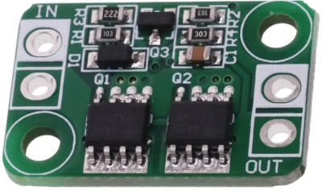
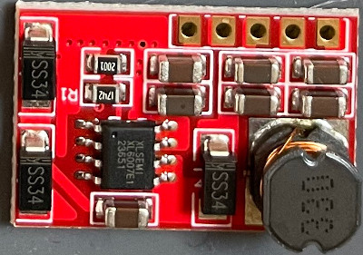

# Omega DCA (DC Adapter) v1

DC adapter for the [Omega Home Computer](https://github.com/skiselev/omega).

## Introduction

This is a simple DC adapter for the Omega Home Computer with the following features:

* External DC input power supply
* Wide input voltage from DC +6.5V to DC +24V
* Max input current 4A
* Power control via external SPDT switch
* Output voltages:
    * 3x independent regulated DC +5V 1.5A (max 3A)
    * 1x independent regulated DC +12V 700mA and -12V 150mA
* Three independent power circuits
* Common Reverse Polarity Protection (RPP), protects the Omega Home Computer from connecting a power barrel with inverted polarity
* Per circuit thermal shutdown, protects the DCA from damage when operating at exceedingly high temperatures
* Per circuit shortcircuit and Over Current Protection (OCP), protects the Omega Home Computer from shorts or excessive current (typ 5.5A)
* Per circuit Over Voltage Protection (OVP), protects the Omega Home Computer from excessive high voltages (typ 5.52V)
* Per circuit Under Voltage Protection (UVP), protects the Omega Home Computer from excessive low voltages (typ ~3V)

## Rationale

When I upgraded my Omega Home Computer with an audio amplifier board and a floppy drive I detected that, no matter how good was the power supply used, the Omega Home Computer suffered sudden resets due to power-related issues when performing some operations like, for example:
* turning on the audio amplifier while the Omega Home Computer was turned on
* increasing the audio amplifier volume up beyond a certain limit when playing compute intensive games
* inserting a floppy disk

My Omega Home Computer was using the [dc-adapter 1.5-1.6b](https://msxmakers.design.blog/proyectos/omega-home-computer/mini-fuente-dc-dc/) from [msxmakers!](https://msxmakers.design.blog/) with an external 5V power supply.

I measured the peak power consumption of the Omega Home Computer at about 1.7A with the audio amplifier on and the floppy drive spinning.

I checked several +5V power supplies with no success:
* LJH074-050030W 5V 3A (the one I purchased with the Omega Home Computer kit)
* YU0508 5V 8A (another "white brand" PSU)
* KORAD KA3005P 30V 5A (my lab bench programmable power supply...)

I used an electronic load tester (DL24 150W) and a separate multimeter (VC99) to check the actual voltage of the power supplies under load (at the power supply connector end):
* LJH074-050030W 5V 3A -> dropped to 4.9V with a 2A load and 4.6V with a 3A load
* YU0508 5V 8A -> kept a steady 5.0V with a 3A load, although it went down to 4.7V when pushing it to 6A
* KORAD KA3005P 30V 5A -> dropped to 4.8V at 5V constant voltage with a 2A load, and to 4.7V with a 3A load (required adjusting voltage to 5.3V to get 5.0V at 3A load)

So according to those load tests and the observed peak power consumption, at least the 5V 8A power supply should be capable of powering the Omega Home Computer and its upgrades without issues.
But it was not the case.

So I assumed the specific power demands of the audio amplifier and the floppy drive were causing the problems (undervoltage?) on the power rail of the Omega Home Computer.
I decided to test if the problem went away by using a separate power supply for the audio amplifier/floppy and the Omega Home Computer. I connected two 5V power supplies with a common ground, one power supply to the Omega and the other to the audio amplifier board and floppy. And voilà, no more resets.

So in the end, I decided to design a small power adapter board to provide separate power circuits to the Omega Home Computer, the audio amplifier and video converter, and the floppy drive, and while at it, added several protections just in case something went wrong with the components.

As there are lots of cheap ready to use mini boards providing part of the requirements needed, I just built a "franken-board" cannibalizing other boards to achieve the final goal.
The Omega DCA was born.

## Overview

The DC Adapter (DCA) is a small power adapter board to provide protected and regulated power to the Omega Home Computer.
It supports the connection of an external DC power supply and a power switch to control power to the computer.

The DCA provides 3 independent power circuits:
* circuit #1 provides power to the Omega Home Computer motherboard and FMPAC (+5V, +12V and -12V) using conectors J10 and J12
* circuit #2 provides power to the external floppy drive (+5V) using connector J8
* circuit #3 provides power to the audio amplifier (+5V) using connector J6 and to the video converter (+5V) using connector J7

## Board

The PCB is a 2-layer design that glues a bunch of ready-to-use mini boards:
* An ideal diode board at U1 to provide Reverse Polarity Protection, i.e. to avoid damage to the Omega Home Computer if a power supply with an incorrect polarity is connected
* Three step down mini boards with thermal shutdown and over current protection at J9, J5 and J3 to provide +5V to the three separate power circuits
* Three over voltage protection mini boards at U2, U3 and U4 to protect the three separate power circuits from overvoltages
* One step up board at J11 to provide +12V and -12V from the 5V output of J9 to feed pins 48 and 50 of the cartridge slots and the FMPAC extension

There are aswell:
* two Positive Temperature Coeficient (PTC) resettable fuses to limit the amount of current delivered to the cartridge slots, as indicated by the [MSX Cartridge Slot](https://www.msx.org/wiki/MSX_Cartridge_slot) specification
* a discharge resistor
* all the necessary connectors

The mini boards are soldered directly to the Omega DCA board using pin headers.

## Bill Of Materials (BOM)

| **ref**    | **item**                              | **req_pcs** | **aliexpress_item**                                                                                                             | **pcs_per_item** | **req_items** | **option**           | **link**                                                                                                       |
| ---------- | ------------------------------------- | ----------- | ------------------------------------------------------------------------------------------------------------------------------- | ---------------- | ------------- | -------------------- | -------------------------------------------------------------------------------------------------------------- |
| U2, U3, U4 | OVP mini board                        | 3           | WeAct Over-Voltage Protection Module OVP 5.5V 2.5A 30V Power-protection Mini                                                    | 1                | 3             |                      | [https://www.aliexpress.com/item/1005001855053619.html](https://www.aliexpress.com/item/1005001855053619.html) |
| J11        | Step Up +12V -12V board               | 1           | A08 DC-DC Boost Power Supply Module 5V 9V 12V 15V 24V Power Supply Module Ultra Small Step Up Circuit Board                     | 1                | 1             | 12V                  | [https://www.aliexpress.com/item/1005003879333333.html](https://www.aliexpress.com/item/1005003879333333.html) |
| U1         | Ideal Diode RPP                       | 1           | Ideal Diode Module Battery Charging Charger Anti Reverse Connection Power Protection Board Module 4A Common Ground DC3-30V      | 1                | 1             |                      | [https://www.aliexpress.com/item/1005004921885625.html](https://www.aliexpress.com/item/1005004921885625.html) |
| J9, J5, J3 | Step Down 5V mini board               | 3           | Mini DC-DC 12-24V To 5V 3A Step Down Power Supply Module Buck Converter Adjustable Efficiency 97.5%                             | 1                | 3             |                      | [https://www.aliexpress.com/item/1005001608750898.html](https://www.aliexpress.com/item/1005001608750898.html) |
| SW1        | 3P block terminal                     | 1           | 10 PCS KF301-5.0-3P Pitch 5.0mm KF301-3P Straight Pin PCB 2 Pin 3 Pin Screw Terminal Block Connector                            | 10               | 1             | Black                | [https://www.aliexpress.com/item/32842003333.html](https://www.aliexpress.com/item/32842003333.html)           |
| J2         | 2P block terminal                     | 1           | 10 PCS KF301-5.0-2P Pitch 5.0mm KF301-2P Straight Pin PCB 2 Pin 3 Pin Screw Terminal Block Connector                            | 10               | 1             | Green                | [https://www.aliexpress.com/item/32842015184.html](https://www.aliexpress.com/item/32842015184.html)           |
| J8         | Berg Connector Right Angle            | 1           | 10pcs Mini 4P Connector Floppy Power Supply Jack 2.54mm Pitch Housing Straight Right Angle Socket Housing Terminals             | 10               | 1             | Right Angle Flat     | [https://www.aliexpress.com/item/1005004647707706.html](https://www.aliexpress.com/item/1005004647707706.html) |
| J10        | 8P KF2510 Male Straight               | 1           | 20 Sets KF2510 Connector Kits 2.54mm Pitch 2/3/4/5/6/7/8/9/10P Straigh Pin Header+Housing+Crimp KF-2510                         | 20               | 1             | 8P                   | [https://www.aliexpress.com/item/4000229636156.html](https://www.aliexpress.com/item/4000229636156.html)       |
| F1, F2     | 50mA PTC fuse                         | 2           | JK16 16V Resettable Fuse WDS16 PPTC RGEF 0.5A 0.75A 1.1A 1.35A 1.5A 1.6A 1.85A 2A 2.5A 3A 4A 5A 6A 10A 11A 12A 13A 14A 15A      | 10               | 1             | 0.05A                | [https://www.aliexpress.com/item/32870368102.html](https://www.aliexpress.com/item/32870368102.html)           |
| J6, J7     | 2P XH2.54 male straight header        | 2           | 230pcs XH2.54 PH2.0 2p 3p 4p 5 pin 2.54mm 2.0mm Pitch Terminal Kit Housing Pin Header JST Connector Wire Connectors Adaptor     | 230              | 1             | XH2.54-1BOX          | [https://www.aliexpress.com/item/33001807525.html](https://www.aliexpress.com/item/33001807525.html)           |
| J12        | 3P XH2.54 male straight header        | 1           | 230pcs XH2.54 PH2.0 2p 3p 4p 5 pin 2.54mm 2.0mm Pitch Terminal Kit Housing Pin Header JST Connector Wire Connectors Adaptor     |                  | 0             | XH2.54-1BOX          | [https://www.aliexpress.com/item/33001807525.html](https://www.aliexpress.com/item/33001807525.html)           |
| F1, F2     | 2.54mm pitch round hole female header | 1           | 5 Pcs Round Hole Pin Header 2.0MM/2.54MM Pitch Row Female/Male, Single Row 1x40P Row 2x40P Double Row Pin Round Pin Gold Plated | 5                | 1             | 2.54 1row femal sliv | [https://www.aliexpress.com/item/4001122376295.html](https://www.aliexpress.com/item/4001122376295.html)       |
| JP3        | 2.54mm pitch male pin header          | 1           | Hot Sale 40Pin 1x40 Single Row Male 2.54 Breakable Pin Header Connector Strip Colorful pin For Arduino Diy Kit                  | 10               | 1             | 5 color              | [https://www.aliexpress.com/item/1005004301488282.html](https://www.aliexpress.com/item/1005004301488282.html) |

### Jumpers

Power circuits #2 and #3 can be merged if desired by populating only J5 and U3 (or J3 and U4) and closing the jumper JP3.
Otherwise, jumper JP3 should always be open.

### Connectors

#### Input Connectors

* J2 2-pin block connector, connects to external DC power supply
* SW1 3-pin block connector, connects to the SPDT power switch in the Omega Home Computer [case](https://github.com/herraa1/omega-case-x3l-v1)

#### Output Connectors

* J10, 8-pin KF2510 power connector (+5V, +12V, -12V, GND), connects to the Omega Home Computer motherboard J10 POWER connector
* J8, 4-pin Berg floppy power connector (+5V, GND), connects to the floppy drive power connector (optional)
* J6, 2-pin XH2.54 audio power connector (+5V, GND), connects to the audio amplifier power connector (optional)
* J7, 2-pin XH2.54 video power connector (+5V, GND), connects to the video converter power connector (optional)
* J12, 3-pin XH2.54 FMPAC power connector (+12V, -12V, GND), connects to the FMPAC board power connector (optional)

## Mini boards

It is recommended to always test all the boards before assembling them to verify that they behave as per their specifications.

### Ideal Diode Board (U1)

This board provides the reverse polarity protection for the Omega DCA and is based on the 4435 P-MOSFET.
The board can work up to 30V 4A and adds minimal voltage drop due to its very low RDS(on) of 20mOhm.
This board works at the external power supply voltage, which must be between 6.5V and 24V as per the DCA board specs design, thus the voltage drop is unimportant in this case.

### Step Down Boards (J9, J5, J3)

The mini step-down boards are based on the MP2315 high efficient synchronous step down switch mode converter.

This integrated circuit provides thermal shutdown at 150C and has a per-cycle current limit protection, which limits current to a 5.5A typically.
The mini step-down board supports input voltages from 4.5V to 24V, but for the Omega DCA only 6.5V to 24V are supported because of the 5V output required.
Maximum efficiency is around 97% when a 6.5V input voltage is used. When using a 12V input voltage efficiency stays around 94%.
The board can sustain a 2.1A load, with peaks of 3A.

Two different options are available to configure the board for 5V output:
* Option #1: Severing the ADJ trace with a cutter and shorting the 5V pad with a solder blob (you may need a magnifying glass or a soldering microscope to cut the ADJ trace)
* Option #2: Using a screw driver to adjust the trimpot to the desired 5V voltage (or even a little bit more, up to 5.3V)

Option 1 will provide the native 5V voltage of the board, which may be around 5V with an error margin (it could be 4.9V, 5.0 or 5.1 if the board is ok)
Option 2 will configure the board with the selected voltage, which may be difficult to achieve due to the margin of the trimpot. Also, touching the trimpot accidentally can change the output voltage of the board to an undesired voltage (this could be specially dangerous in the 5.4V to 5.5V range, as the over voltage protection won't provide protection there).

It is recommended therefore to use Option #1 with a board that provides 5.0V or 5.1V.

### Over Voltage Protection Boards (U2, U3, U4)

Over voltage protection is achieved by a dedicated mini-board using an unknown IC with SMD marking 905HM.
The board cuts power and turns a red led on when more than 5.5V are detected on the input side of the board. It cuts power too when less than ~3V are detected.
The over voltage protection board supports input voltages up to 30V, so it is on the safe side even if the step down board (which sits before it) causes a short.
The board can sustain a 2.5A load, with peaks of 5A, so it is again within the 2.1A load and 3A peak of the step down board.

### Step Up Board (J11)

The Step Up board converts the 5V from the step down board at J9 into +12V and -12V, which are then used on the cartridge slot ports and the FMPAC power connector.
The board supports input voltages from 3.3V to 11V, within the margins of the over voltage protection board that provides the input voltage.
On the current side, the board supports a peak 1.8A on the input and provides just a maximum of 700mA for the +12V and 150mA for the -12V.

The cartridge slot ports are protected by 50mA fuses to comply with the max 50mA for all slots MSX specification. 

